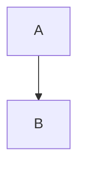

# Task: Markdown Parser Mermaid 擴展

## Description

修改 `markdown_parser.js`，為 marked.js 加入自定義 code block renderer，偵測 `mermaid` 語言標記並輸出特殊的 `<div class="o_woow_mermaid">` 容器。同時調整 DOMPurify 白名單以允許 `data-mermaid` 和 `data-processed` 屬性通過。

## Acceptance Criteria

- [ ] marked.js 的 `mermaid` code block 輸出為 `<div class="o_woow_mermaid" data-mermaid="base64content"><pre><code>原始碼</code></pre></div>`
- [ ] 非 mermaid 語言的 code block 完全不受影響（如 `javascript`、`python`、`bash` 等）
- [ ] 無語言標記的 code block 不受影響
- [ ] DOMPurify 允許 `data-mermaid` 和 `data-processed` 屬性
- [ ] `parseMarkdown()` 返回的 markup 中包含正確的 mermaid 容器 HTML
- [ ] 既有的 markdown 功能完全正常（粗體、斜體、表格、連結等）

## Technical Details

### 修改檔案

`src/static/src/paas/services/markdown_parser.js`

### 自定義 Renderer

```javascript
// 在 marked.use() 中加入自定義 renderer
const renderer = {
    code(code, language) {
        if (language === "mermaid") {
            const encoded = btoa(unescape(encodeURIComponent(code)));
            const escaped = code
                .replace(/&/g, "&amp;")
                .replace(/</g, "&lt;")
                .replace(/>/g, "&gt;");
            return `<div class="o_woow_mermaid" data-mermaid="${encoded}"><pre><code>${escaped}</code></pre></div>`;
        }
        // 其他語言：返回 false 讓 marked 使用預設 renderer
        return false;
    },
};

marked.use({ renderer });
```

**注意**：marked.js v4+ 的 renderer 回傳 `false` 會 fallback 到預設行為。需確認專案使用的 marked.js 版本的 API。

### DOMPurify 白名單調整

```javascript
const cleanHtml = window.DOMPurify.sanitize(rawHtml, {
    ALLOWED_TAGS: [
        // ... 現有標籤
    ],
    ALLOWED_ATTR: [
        "href", "target", "rel", "class",
        "data-mermaid", "data-processed",  // 新增
    ],
});
```

### 測試案例

```markdown
<!-- 應轉為 mermaid 容器 -->


<!-- 應保持為普通 code block -->
```javascript
console.log("hello");
```

<!-- 無語言標記，應保持為普通 code block -->
```
some code
```
```

## Dependencies

- [ ] Task 001 完成（mermaid_loader.js 可用）— 但 parser 修改本身不依賴 loader，只是輸出 HTML 標記

## Effort Estimate

- Size: S
- Hours: 1-2
- Parallel: false（Task 003 依賴此 task 的輸出格式）

## Definition of Done

- [ ] `parseMarkdown()` 正確處理 mermaid code block
- [ ] DOMPurify 不會過濾 data-mermaid 屬性
- [ ] 手動測試：parseMarkdown 輸入含 mermaid block 的 markdown，輸出含 `.o_woow_mermaid` div
- [ ] 手動測試：其他 code block 和 markdown 語法不受影響
