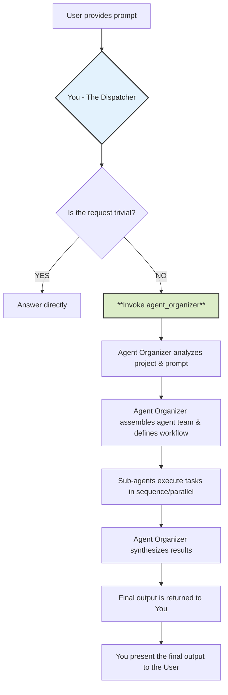
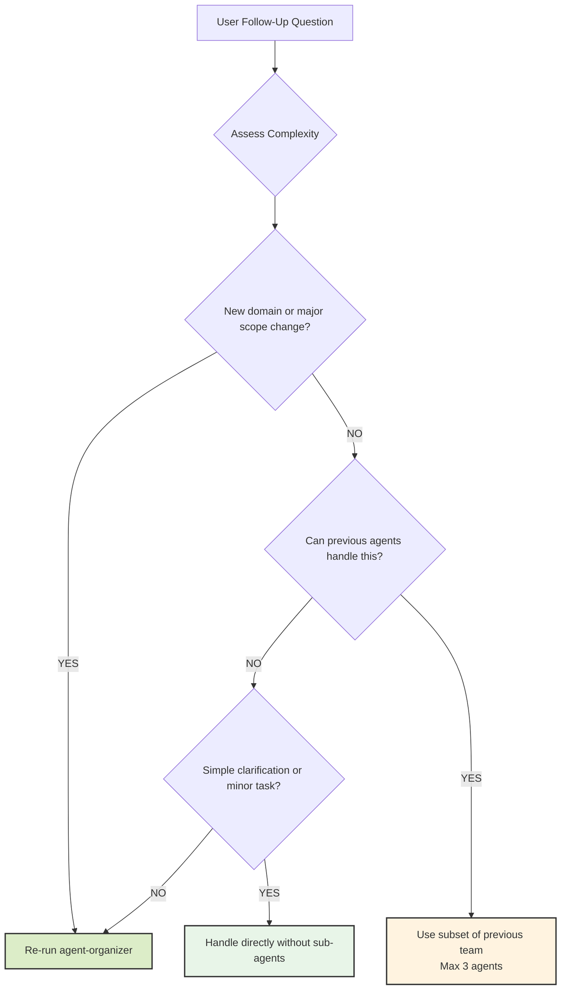

# CLAUDE.md

This file provides guidance to Claude Code (claude.ai/code) when working with code in this repository.

## Project Overview

`woow_paas_platform` is an Odoo 18 addon module providing the foundation for a multi-tenant PaaS application. The module includes:

- **Standalone OWL Application** - Independent frontend at `/woow` with hash-based routing
- **Configuration Settings** - System settings via `res.config.settings`
- **Menu Structure** - Root menu "Woow PaaS" ready for child items
- **Claude Code PM** - Project management integration

### Development Status

```
Phase 1: Foundation      [████████] 100%
Phase 2: OWL App Shell   [████████] 100%
Phase 3: Core Models     [████████] 100%  ✓ Complete (Workspace + WorkspaceAccess)
Phase 4: Cloud Services  [████████] 100%  ✓ Complete (Templates + Services + Operator)
Phase 5: Integrations    [        ]   0%
```

### Cloud Services (New!)

The module now includes a complete Cloud Services feature that allows users to deploy containerized applications via Kubernetes and Helm.

**Key Components**:
- **CloudAppTemplate** model - Application marketplace templates (AnythingLLM, n8n, PostgreSQL, etc.)
- **CloudService** model - Deployed service instances with lifecycle management
- **PaaS Operator Service** - FastAPI service at `extra/paas-operator/` that wraps Helm CLI operations
- **Marketplace UI** - OWL components for browsing and deploying applications

**Architecture**:
```
┌─────────────┐      ┌──────────────┐      ┌──────────────┐
│   Odoo      │─────▶│ PaaS Operator│─────▶│ Kubernetes   │
│  (Frontend) │ HTTP │   (FastAPI)  │ Helm │ + User Pods  │
└─────────────┘      └──────────────┘      └──────────────┘
```

## Development Commands

### Run Odoo with this addon

```bash
# From odoo-server root
./odoo-bin -c odoo.conf -u woow_paas_platform
```

### Update module after changes

```bash
./odoo-bin -c odoo.conf -u woow_paas_platform --stop-after-init
```

### Run tests for this module

```bash
# Odoo module tests
./odoo-bin -c odoo.conf --test-enable --test-tags woow_paas_platform --stop-after-init

# PaaS Operator tests
cd extra/paas-operator
pytest tests/ -v --cov=src
```

### Docker Development (Recommended)

使用 Worktree Development 腳本來管理開發環境：

```bash
# 啟動開發環境（自動設定 .env 並啟動 Docker）
./scripts/start-dev.sh

# 執行測試
./scripts/test-addon.sh

# 清理環境
./scripts/cleanup-worktree.sh
```

詳細說明請參考下方 [Worktree Development](#worktree-development) 章節。

**Test URL**: http://localhost (NOT :8069, to enable websocket)

### PaaS Operator Local Development

When the PaaS Operator is running in Kubernetes without Ingress, use port-forward to access it locally:

```bash
# Port forward the paas-operator service to localhost:8000
kubectl port-forward -n paas-system svc/paas-operator 8000:80

# Verify connection
curl http://localhost:8000/health
```

**Get API Key from Kubernetes Secret:**

```bash
kubectl get secret -n paas-system paas-operator-secret -o jsonpath='{.data.api-key}' | base64 -d
```

**Odoo Configuration (Settings → Woow PaaS):**
- **PaaS Operator URL**: `http://localhost:8000` (本機 Odoo) 或 `http://host.docker.internal:8000` (Docker Odoo)
- **PaaS Operator API Key**: (value from secret above)

> **Note**: The port-forward session must remain active while testing. If you close the terminal, re-run the port-forward command.

**Docker 網路注意事項：**

當 Odoo 運行在 Docker 容器中時，容器內的 `localhost` 指向容器本身，而非宿主機。因此需要使用 `host.docker.internal` 來連接宿主機上的 port-forward：

| Odoo 運行環境 | PaaS Operator URL |
|--------------|-------------------|
| 本機直接運行 | `http://localhost:8000` |
| Docker 容器 | `http://host.docker.internal:8000` |

```bash
# 確認 port-forward 正在運行
kubectl port-forward -n paas-system svc/paas-operator 8000:80

# 從 Docker 容器內測試連線
docker exec -it <odoo-container> curl http://host.docker.internal:8000/health
```

## Architecture

### Directory Structure

```
woow_paas_platform/
├── src/                          # Odoo module source code
│   ├── __manifest__.py           # Module metadata, dependencies, assets
│   ├── __init__.py               # Python package init
│   ├── controllers/
│   │   ├── paas.py               # /woow endpoint controller (JSON API)
│   │   └── cloud_services.py    # Cloud services API endpoints
│   ├── models/
│   │   ├── res_config_settings.py       # PaaS Operator configuration
│   │   ├── workspace.py                 # Workspace model
│   │   ├── workspace_access.py          # Workspace access/member model
│   │   ├── cloud_app_template.py        # Application marketplace templates
│   │   ├── cloud_service.py             # Deployed service instances
│   │   └── paas_operator_client.py      # HTTP client for PaaS Operator
│   ├── views/
│   │   ├── paas_app.xml          # QWeb template for /woow
│   │   ├── res_config_settings_views.xml
│   │   └── menu.xml
│   ├── data/
│   │   └── cloud_app_templates.xml      # Default app templates (AnythingLLM, n8n, etc.)
│   ├── security/
│   │   └── ir.model.access.csv
│   └── static/
│       ├── description/icon.png
│       └── src/
│           ├── paas/             # Standalone OWL App
│           │   ├── app.js        # Mount entry point
│           │   ├── root.js/xml   # Root component + router
│           │   ├── core/router.js
│           │   ├── layout/       # AppShell, Sidebar, Header
│           │   ├── components/   # WoowIcon, WoowCard, WoowButton, Modal
│           │   ├── pages/        # Dashboard, Workspace (List/Detail/Team), Empty
│           │   ├── services/     # workspace_service.js (API client)
│           │   └── styles/       # SCSS theme system + pages/
│           ├── scss/             # Backend asset styles
│           ├── components/       # Backend OWL components (預留)
│           └── services/         # Backend JS services (預留)
├── extra/paas-operator/          # PaaS Operator Service (FastAPI)
│   ├── src/
│   │   ├── main.py              # FastAPI app + middleware
│   │   ├── config.py            # Settings management
│   │   ├── api/                 # API endpoints
│   │   │   ├── releases.py      # Helm release operations
│   │   │   └── namespaces.py    # Namespace management
│   │   ├── services/
│   │   │   └── helm.py          # Helm CLI wrapper
│   │   └── models/
│   │       └── schemas.py       # Pydantic models
│   ├── tests/                   # Operator unit tests
│   ├── helm/                    # Helm chart for K8s deployment
│   │   ├── Chart.yaml
│   │   ├── values.yaml
│   │   └── templates/          # K8s resource templates
│   ├── Dockerfile
│   └── requirements.txt
├── scripts/                      # Development scripts
├── docs/                         # Documentation
│   ├── deployment/              # K8s setup, troubleshooting
│   ├── development/             # Developer guides
│   └── spec/                    # Feature specifications
└── .claude/                      # Claude Code PM configuration
```

### Standalone OWL Application (`/woow`)

The module provides an independent frontend application:

**Entry Point**: `src/controllers/paas.py` → `/woow`
**Template**: `src/views/paas_app.xml`
**Assets**: `woow_paas_platform.assets_paas` bundle

### Cloud Services API Endpoints

**Controller**: `src/controllers/cloud_services.py`

- `GET /api/cloud-services/templates` - List application templates
- `GET /api/cloud-services/templates/<id>` - Get template details
- `GET /api/cloud-services/<workspace_id>/services` - List workspace services
- `POST /api/cloud-services/<workspace_id>/services` - Deploy new service
- `GET /api/cloud-services/services/<id>` - Get service status
- `POST /api/cloud-services/services/<id>/start` - Start service
- `POST /api/cloud-services/services/<id>/stop` - Stop service
- `DELETE /api/cloud-services/services/<id>` - Delete service

**Routes** (hash-based):

- `#/dashboard` - Dashboard page
- `#/workspaces` - Workspace list
- `#/workspaces/:id` - Workspace detail
- `#/workspaces/:id/team` - Workspace team management
- `#/settings`, `#/users`, `#/help` - Empty state placeholders

**Component Architecture**:

```
Root (router logic)
└── AppShell
    ├── Sidebar (navigation)
    ├── Header (user info)
    └── Main Content
        ├── DashboardPage
        ├── WorkspaceListPage
        ├── WorkspaceDetailPage
        ├── WorkspaceTeamPage
        └── EmptyState
```

### Odoo Module Patterns

**Adding a new model:**

1. Create `src/models/your_model.py` with class inheriting `models.Model`
2. Add import in `src/models/__init__.py`
3. Add security rules in `src/security/ir.model.access.csv`
4. Create views in `src/views/your_model_views.xml`
5. Update `src/__manifest__.py` data list

**Adding frontend assets:**

1. Put OWL components in `src/static/src/paas/components/`
2. Register in `src/__manifest__.py` under `woow_paas_platform.assets_paas`

**Extending existing models:**

```python
class ResConfigSettings(models.TransientModel):
    _inherit = 'res.config.settings'
    # Add fields with config_parameter for system settings
```

## Code Style Guide

### Python

```python
# Model naming
class WoowSubscription(models.Model):
    _name = 'woow_paas_platform.subscription'
    _description = 'PaaS Subscription'

# Field definitions - use keyword arguments
name = fields.Char(
    string='Name',
    required=True,
    help='Brief description for users',
)
```

### JavaScript/OWL

```javascript
/** @odoo-module **/

import { Component } from "@odoo/owl";

export class SubscriptionCard extends Component {
  static template = "woow_paas_platform.SubscriptionCard";
  static props = {
    subscription: Object,
  };
}
```

### SCSS

```scss
// Use .o_woow_ prefix for isolation
.o_woow_subscription_card {
  &__header {
  }
  &__body {
  }
  &--active {
  }
}
```

### XML IDs

```xml
<!-- Pattern: {module}.{type}_{model}_{view_type} -->
<record id="view_subscription_form" model="ir.ui.view">
```

## Dependencies

### Odoo Module
- Base Odoo modules: `base`, `web`
- Odoo version: 18.0
- External fonts: Google Fonts (Manrope, Outfit), Material Symbols

### PaaS Operator Service
- Python 3.11+
- FastAPI
- Helm 3.13+
- kubectl 1.28+
- Kubernetes cluster access

### Deployment
- Kubernetes 1.28+ (K3s recommended for self-hosted)
- PostgreSQL 14+ (for Odoo)
- Cloudflare DNS (or custom domain for Ingress)

## Claude Code PM

This project uses Claude Code PM (`.claude/` directory) for project management.

### Quick Commands

- `/pm:help` - Show all available commands
- `/pm:status` - Project status overview
- `/pm:next` - Next available task
- `/pm:prd-new <name>` - Create new PRD

### Context Files

- `.claude/context/project-overview.md` - Current features and status
- `.claude/context/tech-context.md` - Technology stack
- `.claude/context/project-style-guide.md` - Coding conventions
- `.claude/context/system-patterns.md` - Architecture patterns

### Rules Reference

The `.claude/rules/` directory contains coding standards and operation patterns that are automatically loaded by Claude Code PM:

| Rule File | Description |
|-----------|-------------|
| `datetime.md` | ISO 8601 datetime format standards for frontmatter |
| `frontmatter-operations.md` | YAML frontmatter reading/updating patterns |
| `github-operations.md` | GitHub CLI patterns and repository protection |
| `standard-patterns.md` | Core validation, output, and error handling patterns |
| `strip-frontmatter.md` | Removing frontmatter before GitHub sync |
| `path-standards.md` | Relative path usage for portability and privacy |
| `worktree-operations.md` | Git worktree creation and management |
| `branch-operations.md` | Git branch workflows |
| `agent-coordination.md` | Multi-agent parallel execution rules |
| `test-execution.md` | Test runner patterns |
| `use-ast-grep.md` | AST-based code search and refactoring |

## Worktree Development

此專案支援 git worktree 並行測試，每個 worktree 可以獨立運行自己的 Docker 環境。

### 快速開始

```bash
# 1. 建立 worktree
git worktree add ../woow_paas_platform.worktrees/epic-feature -b epic/feature

# 2. 切換到 worktree
cd ../woow_paas_platform.worktrees/epic-feature

# 3. 自動設定環境並啟動
./scripts/start-dev.sh
```

### 環境配置

每個 worktree 會自動配置：
- **唯一的 port**（8069 + 目錄 hash）- 避免衝突
- **獨立的資料庫名稱**（`woow_<branch>`）- 資料隔離
- **獨立的 Docker 容器**（基於 `COMPOSE_PROJECT_NAME`）

所有配置透過 `.env` 檔案管理（由 `scripts/setup-worktree-env.sh` 自動生成）。

### 可用腳本

```bash
# 設定環境變數（.env）
./scripts/setup-worktree-env.sh

# 啟動開發環境
./scripts/start-dev.sh

# 執行測試
./scripts/test-addon.sh

# 清理環境
./scripts/cleanup-worktree.sh
```

### 並行測試範例

同時運行多個 worktree：

```bash
# Terminal 1 - 主專案
cd /path/to/woow_paas_platform
./scripts/start-dev.sh
# → http://localhost:8069 (woow_main)

# Terminal 2 - Feature A
cd ../woow_paas_platform.worktrees/epic-feature-a
./scripts/start-dev.sh
# → http://localhost:8234 (woow_epic_feature_a)

# Terminal 3 - Feature B
cd ../woow_paas_platform.worktrees/fix-bug-123
./scripts/start-dev.sh
# → http://localhost:8501 (woow_fix_bug_123)
```

每個實例使用各自的資料庫，互不干擾。

### 共享 PostgreSQL（可選）

如果希望節省資源，可以讓所有 worktree 共享一個 PostgreSQL 容器：

```bash
# 1. 首次啟動共享資料庫（在主專案目錄執行一次）
docker compose -f docker-compose.shared-db.yml up -d

# 2. 在每個 worktree 設定環境（使用 --shared-db 參數）
./scripts/setup-worktree-env.sh --shared-db

# 3. 啟動（不會建立獨立的 PostgreSQL）
./scripts/start-dev.sh
```

### VS Code 本機開發

使用本機 VS Code（不使用 Dev Container）：
- 每個 worktree 可以開啟獨立的 VS Code 視窗
- Odoo 服務運行在 Docker 容器中
- 支援遠端調試（Python debugger attach to container）

推薦擴充套件已配置在 `.vscode/extensions.json`。

### 重要提醒

- **網址測試**：使用 http://localhost（不是 :8069）以啟用 websocket
- **自動配置**：環境變數由腳本自動生成，請勿手動修改 `.env`
- **資料庫名稱**：基於 branch 名稱，將 `/` 和 `-` 轉為 `_`
- **Port 範圍**：8069-9068（基於目錄路徑 hash 計算）

<!-- lst97 CLAUDE.md Start -->

# Full Stack Development Guidelines

## Philosophy

### Core Beliefs

- **Iterative delivery over massive releases** – Ship small, working slices of functionality from database to UI.
- **Understand before you code** – Explore both front-end and back-end patterns in the existing codebase.
- **Pragmatism over ideology** – Choose tools and architectures that serve the project's goals, not personal preference.
- **Readable code over clever hacks** – Optimize for the next developer reading your code, not for ego.

### Simplicity Means

- One clear responsibility per module, class, or API endpoint.
- Avoid premature frameworks, libraries, or abstractions.
- While latest and new technology is considerable, stable and efficient should be prioritized.
- If your integration flow diagram needs an explanation longer than 3 sentences, it's too complex.

---

## Process

### 1. Planning & Staging

Break work into 3–5 cross-stack stages (front-end, back-end, database, integration). Document in `IMPLEMENTATION_PLAN.md`:

```markdown
## Stage N: [Name]

**Goal**: [Specific deliverable across the stack]
**Success Criteria**: [User story + passing tests]
**Tests**: [Unit, integration, E2E coverage]
**Status**: [Not Started|In Progress|Complete]
```

- Update status after each merge.
- Delete the plan file after all stages are verified in staging and production.

### 2. Implementation Flow

- **Understand** – Identify existing patterns for UI, API, DB, and CI/CD.
- **Test First** – For back-end, write API integration tests; for front-end, write component/unit tests.
- **Implement Minimal** – Just enough code to pass all tests.
- **Refactor Safely** – Clean code with test coverage at 60%+ for changed areas.
- **Commit Clearly** – Reference plan stage, include scope (front-end, back-end, DB).

### 3. When Stuck (Max 3 Attempts)

- **Document Failures** – Include console logs, stack traces, API responses, and network traces.
- **Research Alternatives** – Compare similar solutions across different tech stacks.
- **Check Architecture Fit** – Could this be a UI-only change? A DB query rewrite? An API contract change?
- **Try a Different Layer** – Sometimes a front-end bug is a back-end response problem.

---

## Technical Standards

### Architecture

- Composition over inheritance for both UI components and service classes.
- Interfaces/contracts over direct calls – Use API specs and type definitions.
- Explicit data flow – Document request/response shapes in OpenAPI/Swagger.
- TDD when possible – Unit tests + integration tests for each feature slice.

### Code Quality

**Every commit must:**

- Pass linting, type checks, and formatting.
- Pass all unit, integration, and E2E tests.
- Include tests for new logic, both UI and API.

**Before committing:**

- Run formatter, linter, and security scans.
- Ensure commit messages explain _why_, not just _what_.

### Error Handling

- Fail fast with descriptive UI error messages and meaningful API status codes.
- Include correlation IDs in logs for tracing full-stack requests.
- Handle expected errors at the right layer; avoid silent catch blocks.

### Decision Framework

When multiple solutions exist, prioritize in this order:

1. **Testability** – Can UI and API behavior be tested in isolation?
2. **Readability** – Will another dev understand this in 6 months?
3. **Consistency** – Matches existing API/UI patterns?
4. **Simplicity** – Is this the least complex full-stack solution?
5. **Reversibility** – Can we swap frameworks/services easily?

## Project Integration

### Learning the Codebase

- Identify 3 similar features and trace the flow: UI → API → DB.
- Use the same frameworks, libraries, and test utilities.

### Tooling

- Use the project's existing CI/CD, build pipeline, and testing stack.
- No new tools unless approved via RFC with a migration plan.

## Quality Gates

### Definition of Done

- Tests pass at all levels (unit, integration, E2E).
- Code meets UI and API style guides.
- No console errors or warnings.
- No unhandled API errors in the UI.
- Commit messages follow semantic versioning rules.

### Test Guidelines

- **For UI:** Test user interactions and visible changes, not implementation details.
- **For APIs:** Test responses, status codes, and side effects.
- Keep tests deterministic and fast; use mocks/fakes where possible.

## Important Reminders

**NEVER:**

- Merge failing builds.
- Skip tests locally or in CI.
- Change API contracts without updating docs and front-end code.

**ALWAYS:**

- Ship vertical slices of functionality.
- Keep front-end, back-end, and database in sync.
- Update API docs when endpoints change.
- Log meaningful errors for both developers and support teams.

---

# Agent Dispatch Protocol (Follow once the Agent-Organizer sub agent being called or used)

## Philosophy

### Core Belief: Delegate, Don't Solve

- **Your purpose is delegation, not execution.** You are the central command that receives a request and immediately hands it off to a specialized mission commander (`agent-organizer`).
- **Structure over speed.** This protocol ensures every complex task is handled with a structured, robust, and expert-driven approach, leveraging the full capabilities of specialized sub-agents.
- **Clarity of responsibility.** By dispatching tasks, you ensure the right virtual agent with the correct skills is assigned to the job, leading to a higher quality outcome.

### Mental Model: The Workflow You Initiate

Understanding your role is critical. You are the starting point for a larger, more sophisticated process.



---

## Process

### 1. Triage the Request

Analyze the user's prompt to determine if it requires delegation.

**Delegation is MANDATORY if the prompt involves:**

- **Code Generation:** Writing new files, classes, functions, or significant blocks of code.
- **Refactoring:** Modifying or restructuring existing code.
- **Debugging:** Investigating and fixing bugs beyond simple syntax errors.
- **Analysis & Explanation:** Being asked to "understand," "analyze," or "explain" a project, file, or codebase.
- **Adding Features:** Implementing any new functionality.
- **Writing Tests:** Creating unit, integration, or end-to-end tests.
- **Documentation:** Generating or updating API docs, READMEs, or code comments.
- **Strategy & Planning:** Requests for roadmaps, tech-debt evaluation, or architectural suggestions.

### 2. Execute the Dispatch

If the request meets the criteria above, your sole action is to call the `agent_organizer` tool with the user's prompt.

### 3. Await Completion

Once you have invoked the `agent-organizer`, your role becomes passive. You must wait for the `agent-organizer` to complete its entire workflow and return a final, consolidated output.

---

## Follow-Up Question Handling Protocol

When users ask follow-up questions, apply intelligent escalation based on complexity to avoid unnecessary overhead while maintaining quality.

### Complexity Assessment Framework

- **Simple Follow-ups (Handle Directly):**
  - Clarification questions about previous work ("What does this function do?").
  - Minor modifications ("Can you fix this typo?").
  - Single-step tasks taking less than 5 minutes.

- **Moderate Follow-ups (Use Previously Identified Agents):**
  - Building on existing work within the same domain ("Add error handling to this API").
  - Extending or refining previous deliverables ("Make the UI more responsive").
  - Tasks requiring 1-3 of the previously selected agents.

- **Complex Follow-ups (Re-run `agent-organizer`):**
  - New requirements spanning multiple domains ("Now add authentication and deploy to AWS").
  - Significant scope changes ("Actually, let's make this a mobile app instead").
  - Tasks requiring different expertise than previously identified.

### Follow-Up Decision Tree



---

## Important Reminders

**NEVER:**

- Attempt to solve a complex project or coding request on your own.
- Interfere with the `agent-organizer`'s process or try to "help" the sub-agents.
- Modify or add commentary to the final output returned by the `agent-organizer`.

**ALWAYS:**

- Delegate to the `agent-organizer` if a prompt is non-trivial or if you are in doubt.
- Present the final, complete output from the `agent-organizer` directly to the user.
- Use the Follow-Up Decision Tree to handle subsequent user questions efficiently.

---

### Example Scenario

**User Prompt:** "This project is a mess. Can you analyze my Express.js API, create documentation for it, and refactor the `userController.js` file to be more efficient?"

**Your Internal Monologue and Action:**

1. **Analyze Prompt:** The user is asking for analysis, documentation creation, and code refactoring.
2. **Check Delegation Criteria:** This hits at least three mandatory triggers. This is a non-trivial task.
3. **Apply Core Philosophy:** My role is to dispatch, not to solve. I must invoke the `agent-organizer`.
4. **Execute Dispatch:** Run the `agent_organizer` sub-agent with the user's prompt.
5. **Await Completion:** My job is now done until the organizer returns the complete result. I will then present that result to the user.

<!-- lst97 CLAUDE.md End -->
