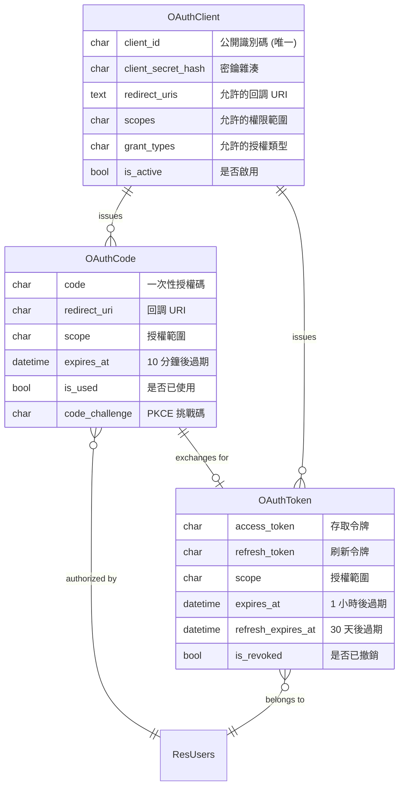
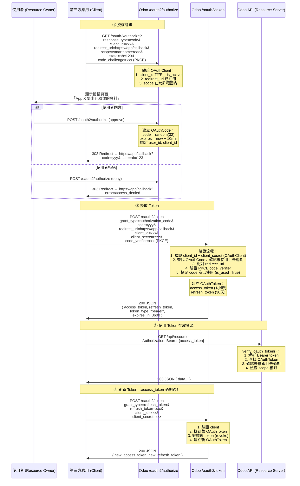
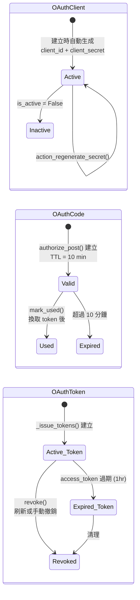

# OAuth 2.0 Architecture

本文件說明 `woow_paas_platform` 模組中 OAuth 2.0 的實作架構，包含三個核心 Model 的關係、完整授權流程，以及程式碼對應。

## Model 關聯

## 角色對應

| Model | OAuth 2.0 角色 | 說明 |
|---|---|---|
| **OAuthClient** | Client（第三方應用） | 註冊的應用程式，持有 `client_id` / `client_secret` |
| **OAuthCode** | Authorization Code（授權碼） | 使用者同意後產生的一次性代碼，10 分鐘過期 |
| **OAuthToken** | Access Token + Refresh Token | 最終可用來呼叫 API 的令牌 |

## 原始碼位置

| 檔案 | 說明 |
|---|---|
| `src/models/oauth_client.py` | OAuthClient model 定義 |
| `src/models/oauth_code.py` | OAuthCode model 定義 |
| `src/models/oauth_token.py` | OAuthToken model 定義 |
| `src/controllers/oauth2.py` | OAuth 2.0 Controller（所有 endpoint） |

## Authorization Code Grant 完整流程

## 支援的 Grant Types

### 1. Authorization Code（標準授權碼）

最常見的流程，適用於有後端的 Web 應用。

- **Endpoint**: `GET/POST /oauth2/authorize` → `POST /oauth2/token`
- **Controller**: `authorize_get()` → `authorize_post()` → `_handle_authorization_code()`
- **支援 PKCE**: 是（`code_challenge` + `code_verifier`，方法 `S256` 或 `plain`）

### 2. Refresh Token（刷新令牌）

在 access_token 過期後，用 refresh_token 取得新的 token。

- **Endpoint**: `POST /oauth2/token` (grant_type=refresh_token)
- **Controller**: `_handle_refresh_token()`
- **行為**: 撤銷舊 token，發行全新的 access_token + refresh_token

### 3. Client Credentials（機器對機器）

不需要使用者參與，適用於服務間通訊。

- **Endpoint**: `POST /oauth2/token` (grant_type=client_credentials)
- **Controller**: `_handle_client_credentials()`
- **特點**: 不發行 refresh_token，使用 SUPERUSER 作為 service user

## API Endpoints 總覽

| Endpoint | Method | Auth | 說明 | RFC |
|---|---|---|---|---|
| `/oauth2/authorize` | GET | user | 顯示授權頁面 | RFC 6749 §4.1.1 |
| `/oauth2/authorize` | POST | user | 處理使用者同意/拒絕 | RFC 6749 §4.1.2 |
| `/oauth2/token` | POST | none | 換取/刷新 token | RFC 6749 §4.1.3, §6 |
| `/oauth2/introspect` | POST | none | 查詢 token 狀態 | RFC 7662 |
| `/oauth2/revoke` | POST | none | 撤銷 token | RFC 7009 |

## 程式碼對應表

| OAuth 2.0 步驟 | Controller 方法 | 使用的 Model |
|---|---|---|
| Authorization Request | `authorize_get()` | 讀取 **OAuthClient** 驗證參數 |
| User Consent | `authorize_post()` | 建立 **OAuthCode** |
| Token Exchange | `_handle_authorization_code()` | 讀取/標記 **OAuthCode** → 建立 **OAuthToken** |
| Refresh Token | `_handle_refresh_token()` | 撤銷舊 **OAuthToken** → 建立新 **OAuthToken** |
| Client Credentials | `_handle_client_credentials()` | 驗證 **OAuthClient** → 建立 **OAuthToken** |
| Token Introspection | `introspect()` | 讀取 **OAuthToken** 回傳狀態 |
| Token Revocation | `revoke()` | 撤銷 **OAuthToken** |
| API 保護 | `verify_oauth_token()` | 驗證 **OAuthToken** 的有效性和 scope |

## Model 生命週期

## Token 時效設定

| 參數 | 值 | 定義位置 |
|---|---|---|
| `ACCESS_TOKEN_LIFETIME` | 1 小時 | `src/controllers/oauth2.py:17` |
| `REFRESH_TOKEN_LIFETIME` | 30 天 | `src/controllers/oauth2.py:18` |
| `AUTH_CODE_LIFETIME` | 10 分鐘 | `src/controllers/oauth2.py:19` |

## 可用的 Scopes

| Scope | 說明 |
|---|---|
| `smarthome:read` | 讀取 Smart Home 和 Workspace 資料 |
| `smarthome:tunnel` | 存取裝置的 tunnel 連線 |
| `workspace:read` | 讀取 Workspace 資訊 |

## 安全機制

- **Client Secret**: 使用 `werkzeug.security.generate_password_hash` 雜湊儲存，明文只在建立時顯示一次
- **PKCE**: 支援 `S256` 和 `plain` 方法，防止授權碼攔截攻擊
- **Authorization Code 一次性**: 使用後立即標記 `is_used=True`
- **Token Rotation**: 刷新時撤銷舊 token，發行全新 token pair
- **Redirect URI 精確比對**: 必須與 OAuthClient 預先註冊的 URI 完全一致
- **CSRF 保護**: `state` 參數由客戶端生成，原樣回傳驗證
- **No-Cache Headers**: Token 回應加上 `Cache-Control: no-store`
