# n8n Cloud Service 生命週期

本文件完整說明使用者在 Woow PaaS Platform 上建立一個 n8n Cloud Service 時，從前端操作到最終產生可從外部連線的 FQDN URL，整個系統在背後執行的完整流程。

---

## 目錄

1. [高層架構概覽](#1-高層架構概覽)
2. [系統元件介紹](#2-系統元件介紹)
3. [建立流程：完整序列圖](#3-建立流程完整序列圖)
4. [Phase 1：前端觸發與 Odoo Controller](#4-phase-1前端觸發與-odoo-controller)
5. [Phase 2：背景執行緒部署](#5-phase-2背景執行緒部署)
6. [Phase 3：Helm Release 安裝與 Cloudflare Tunnel](#6-phase-3helm-release-安裝與-cloudflare-tunnel)
7. [Phase 4：MCP Sidecar 注入](#7-phase-4mcp-sidecar-注入)
8. [Phase 5：n8n 初始化（Post-Deploy Init）](#8-phase-5n8n-初始化post-deploy-init)
9. [Phase 6：MCP Server 自動註冊](#9-phase-6mcp-server-自動註冊)
10. [狀態機與生命週期](#10-狀態機與生命週期)
11. [網路拓撲與 FQDN 產生邏輯](#11-網路拓撲與-fqdn-產生邏輯)
12. [API Key 的產生與同步機制](#12-api-key-的產生與同步機制)
13. [刪除流程](#13-刪除流程)
14. [關鍵檔案索引](#14-關鍵檔案索引)

---

## 1. 高層架構概覽

整個 n8n Cloud Service 的部署涉及三個主要層級：Odoo（應用層）、PaaS Operator（基礎設施控制層）、Kubernetes（執行層）。

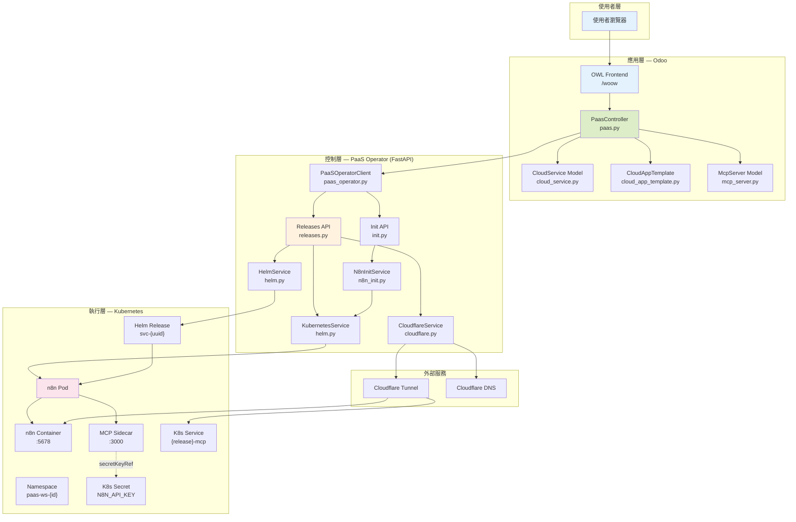

---

## 2. 系統元件介紹

### 2.1 Odoo 模組（應用層）

| 元件 | 檔案 | 職責 |
|------|------|------|
| PaasController | `src/controllers/paas.py` | 處理前端 API 請求，協調部署流程 |
| CloudService Model | `src/models/cloud_service.py` | 服務實例的資料模型（狀態、Helm 資訊、密鑰等） |
| CloudAppTemplate Model | `src/models/cloud_app_template.py` | 應用模板（Helm chart 設定、MCP sidecar 設定） |
| PaaSOperatorClient | `src/services/paas_operator.py` | 與 PaaS Operator 通訊的 HTTP Client |
| McpServer Model | `src/models/mcp_server.py` | MCP Server 記錄與工具發現 |
| ResConfigSettings | `src/models/res_config_settings.py` | 系統設定（Operator URL、API Key、Domain） |

### 2.2 PaaS Operator（控制層）

| 元件 | 檔案 | 職責 |
|------|------|------|
| FastAPI App | `extra/paas-operator/src/main.py` | API 入口、認證中介層 |
| Releases API | `extra/paas-operator/src/api/releases.py` | Helm Release CRUD + Sidecar Patch |
| Init API | `extra/paas-operator/src/api/init.py` | n8n 初始化端點 |
| HelmService | `extra/paas-operator/src/services/helm.py` | Helm CLI 包裝器 |
| KubernetesService | `extra/paas-operator/src/services/helm.py` | kubectl 操作（Pod、Secret、Deployment） |
| CloudflareService | `extra/paas-operator/src/services/cloudflare.py` | Cloudflare Tunnel 與 DNS 管理 |
| N8nInitService | `extra/paas-operator/src/services/n8n_init.py` | n8n Owner 設定 + API Key 產生 |

### 2.3 n8n 模板設定

n8n 的 CloudAppTemplate 預設配置（定義在 `src/data/cloud_app_templates.xml`）：

| 欄位 | 值 | 說明 |
|------|-----|------|
| `helm_chart_name` | `oci://8gears.container-registry.com/library/n8n` | OCI Helm chart |
| `default_port` | `5678` | n8n 預設 HTTP port |
| `ingress_enabled` | `True` | 建立 Cloudflare Tunnel route |
| `mcp_enabled` | `True` | 啟用 MCP sidecar |
| `mcp_sidecar_image` | `ghcr.io/czlonkowski/n8n-mcp:latest` | MCP sidecar Docker image |
| `mcp_sidecar_port` | `3000` | Sidecar 監聽 port |
| `mcp_transport` | `streamable_http` | MCP 通訊協定 |
| `mcp_endpoint_path` | `/mcp` | MCP 端點路徑 |
| `mcp_api_key_helm_path` | `main.secret.N8N_API_KEY` | API Key 在 Helm values 中的路徑 |
| `post_deploy_init_type` | `n8n` | 部署後自動初始化類型 |

---

## 3. 建立流程：完整序列圖

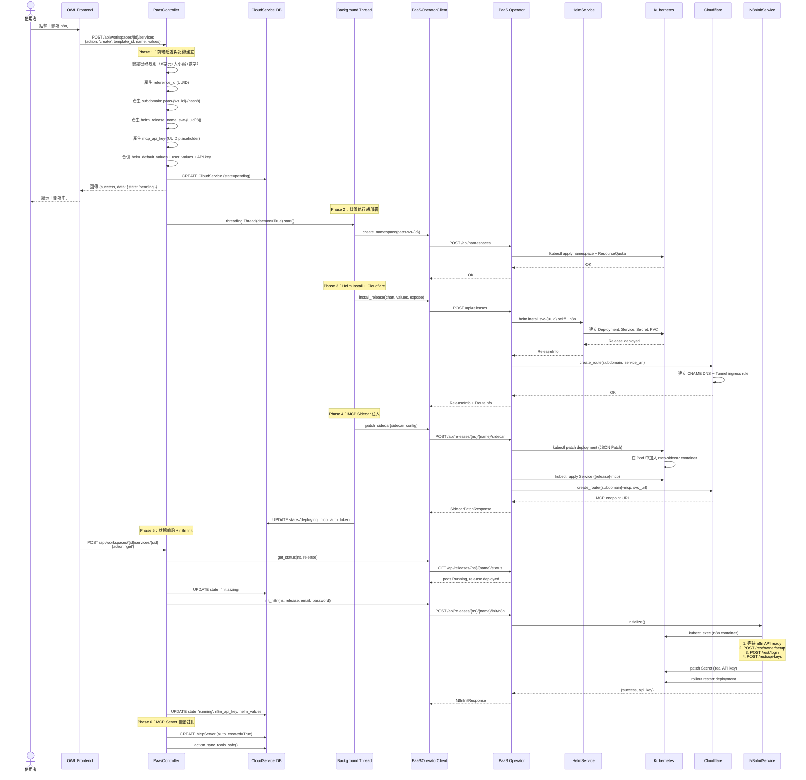

---

## 4. Phase 1：前端觸發與 Odoo Controller

### 4.1 使用者操作

使用者在 OWL Frontend (`/woow`) 的 Marketplace 頁面選擇 n8n 模板，填寫以下資訊：

- **Service Name**：自訂服務名稱
- **n8n Admin Email**：管理員帳號 Email
- **n8n Admin Password**：管理員密碼（至少 8 字元，含大小寫字母與數字）
- **可選設定**：Database Type、Timezone、Log Level

### 4.2 API 請求

前端發送 JSON-RPC 請求：

```
POST /api/workspaces/{workspace_id}/services
{
    "action": "create",
    "template_id": <n8n template ID>,
    "name": "my-n8n",
    "values": {
        "_init.owner_email": "user@example.com",
        "_init.owner_password": "MyP@ssw0rd",
        "config.database.type": "sqlite",
        "main.config.GENERIC_TIMEZONE": "Asia/Taipei"
    }
}
```

### 4.3 Controller 處理邏輯

`_create_service()` 方法（`src/controllers/paas.py:1388`）執行以下步驟：

**4.3.1 驗證**

- 檢查 template 是否存在且啟用
- 驗證密碼規則（n8n 特有）

**4.3.2 身份與命名產生**

```python
reference_id = str(uuid.uuid4())                    # 不可變唯一識別碼
subdomain = f"paas-{workspace.id}-{md5_hash[:8]}"   # 加鹽 hash 防猜測
helm_release_name = f"svc-{reference_id[:8]}"        # Helm release 名稱
helm_namespace = f"paas-ws-{workspace.id}"           # K8s namespace
```

**4.3.3 值處理與 API Key 注入**

1. 分離 `_init.*` 前綴的參數（用於 post-deploy init，不傳入 Helm）
2. 將使用者可配置的值與 template 預設值深度合併
3. 產生 `mcp_api_key`（UUID placeholder），注入到 Helm values 的 `main.secret.N8N_API_KEY` 路徑

合併後的 Helm values 範例：

```json
{
    "config": {"database": {"type": "sqlite"}},
    "main": {
        "config": {
            "GENERIC_TIMEZONE": "Asia/Taipei",
            "N8N_LOG_LEVEL": "info",
            "N8N_PUBLIC_API_ENABLED": "true"
        },
        "secret": {
            "N8N_API_KEY": "a1b2c3d4-...-placeholder-uuid"
        },
        "resources": { ... },
        "persistence": {"enabled": true, "type": "dynamic", "size": "2Gi"}
    },
    "updateStrategy": {"type": "Recreate"}
}
```

**4.3.4 建立 DB 記錄並啟動背景執行緒**

- 建立 `CloudService` 記錄，`state='pending'`
- 立即回傳 HTTP response 給前端（非阻塞）
- 啟動 `daemon=True` 的背景 Thread 執行部署

---

## 5. Phase 2：背景執行緒部署

`_deploy_service_background()` 方法（`src/controllers/paas.py:1520`）在獨立的資料庫 cursor 中運作，不受 HTTP request 生命週期影響。

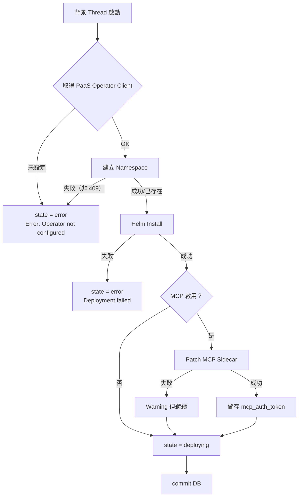

### 5.1 Namespace 建立

透過 `PaaSOperatorClient.create_namespace()` 呼叫 PaaS Operator：

```
POST /api/namespaces
{
    "name": "paas-ws-42",
    "cpu_limit": "24",
    "memory_limit": "24Gi",
    "storage_limit": "300Gi"
}
```

PaaS Operator 執行 `kubectl apply` 建立 Namespace + ResourceQuota。若 Namespace 已存在（HTTP 409），則忽略錯誤繼續。

### 5.2 Helm Release 安裝

透過 `PaaSOperatorClient.install_release()` 呼叫 PaaS Operator：

```
POST /api/releases
{
    "namespace": "paas-ws-42",
    "name": "svc-a1b2c3d4",
    "chart": "oci://8gears.container-registry.com/library/n8n",
    "create_namespace": true,
    "values": { ... merged helm values ... },
    "expose": {
        "enabled": true,
        "subdomain": "paas-42-f8e3a1b2"
    }
}
```

---

## 6. Phase 3：Helm Release 安裝與 Cloudflare Tunnel

### 6.1 Helm Install 流程

PaaS Operator 的 `HelmService.install()` 執行：

```bash
helm install svc-a1b2c3d4 oci://8gears.container-registry.com/library/n8n \
    --namespace paas-ws-42 \
    --create-namespace \
    --values /tmp/values-xxxxx.yaml \
    --output json
```

n8n Helm chart 在 Kubernetes 中建立：

| 資源 | 名稱格式 | 說明 |
|------|---------|------|
| Deployment | `svc-a1b2c3d4-n8n` | n8n 主要 Deployment |
| Service | `svc-a1b2c3d4-n8n` | ClusterIP Service（port 5678） |
| Secret | `svc-a1b2c3d4-n8n-app-secret` | 存放 N8N_API_KEY 等 secret |
| PVC | `svc-a1b2c3d4-n8n` | 2Gi persistent volume（SQLite 資料） |

### 6.2 Cloudflare Tunnel Route 建立

Helm install 成功後，`_create_cloudflare_route()` 執行：

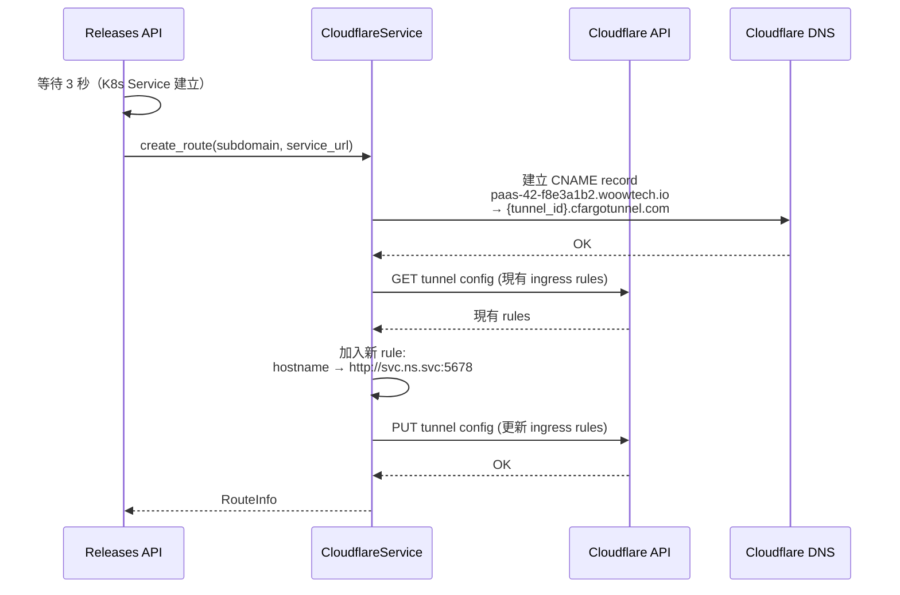

**產生的 FQDN**：`https://paas-42-f8e3a1b2.woowtech.io`

路由邏輯：
1. 使用者存取 `https://paas-42-f8e3a1b2.woowtech.io`
2. Cloudflare DNS 解析 CNAME 到 Tunnel
3. Tunnel ingress rule 轉發到 `http://svc-a1b2c3d4-n8n.paas-ws-42.svc.cluster.local:5678`
4. n8n container 回應

---

## 7. Phase 4：MCP Sidecar 注入

### 7.1 為什麼不用 Helm 直接部署 Sidecar？

n8n Helm chart 不原生支援 sidecar container。因此系統採用「先 Helm install，再 kubectl patch」的策略，透過 JSON Patch 將 MCP sidecar container 注入到現有 Deployment 中。

### 7.2 Sidecar 配置建構

`_build_mcp_sidecar_config()` 方法（`src/controllers/paas.py:1202`）建構 sidecar 規格：

```json
{
    "container": {
        "name": "mcp-sidecar",
        "image": "ghcr.io/czlonkowski/n8n-mcp:latest",
        "ports": [{"containerPort": 3000}],
        "env": [
            {"name": "MCP_MODE", "value": "http"},
            {"name": "AUTH_TOKEN", "value": "<generated-uuid>"},
            {"name": "N8N_API_URL", "value": "http://localhost:5678"},
            {"name": "PORT", "value": "3000"},
            {"name": "AUTH_RATE_LIMIT_MAX", "value": "500"},
            {"name": "AUTH_RATE_LIMIT_WINDOW", "value": "900000"},
            {
                "name": "N8N_API_KEY",
                "valueFrom": {
                    "secretKeyRef": {
                        "name": "svc-a1b2c3d4-n8n-app-secret",
                        "key": "N8N_API_KEY"
                    }
                }
            }
        ],
        "resources": {
            "requests": {"memory": "128Mi", "cpu": "100m"},
            "limits": {"memory": "256Mi", "cpu": "200m"}
        },
        "livenessProbe": {
            "httpGet": {"path": "/health", "port": 3000},
            "initialDelaySeconds": 15,
            "periodSeconds": 30
        },
        "readinessProbe": {
            "httpGet": {"path": "/health", "port": 3000},
            "initialDelaySeconds": 10,
            "periodSeconds": 10
        }
    }
}
```

**重點設計**：`N8N_API_KEY` 使用 `secretKeyRef` 而非直接值。這確保 Pod 重啟時永遠從 K8s Secret 讀取最新的 API Key。

### 7.3 Sidecar Patch 流程

PaaS Operator 的 `patch_sidecar` endpoint（`extra/paas-operator/src/api/releases.py:375`）執行三步驟：

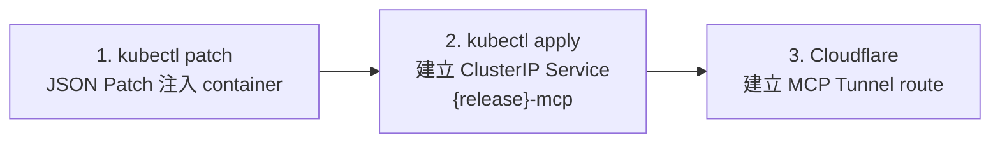

**Step 1：kubectl JSON Patch**

```bash
kubectl patch deployment svc-a1b2c3d4-n8n \
    --namespace paas-ws-42 \
    --type=json \
    --patch='[{"op":"add","path":"/spec/template/spec/containers/-","value":{...}}]'
```

**Step 2：建立 MCP K8s Service**

```yaml
apiVersion: v1
kind: Service
metadata:
  name: svc-a1b2c3d4-mcp
  namespace: paas-ws-42
  labels:
    app.kubernetes.io/instance: svc-a1b2c3d4
    app.kubernetes.io/component: mcp-sidecar
spec:
  type: ClusterIP
  selector:
    app.kubernetes.io/instance: svc-a1b2c3d4
  ports:
    - port: 3000
      targetPort: 3000
      protocol: TCP
      name: mcp
```

**Step 3：建立 MCP Cloudflare Route**

- Subdomain: `paas-42-f8e3a1b2-mcp`
- 產生的 FQDN: `https://paas-42-f8e3a1b2-mcp.woowtech.io`
- 轉發到: `http://svc-a1b2c3d4-mcp.paas-ws-42.svc.cluster.local:3000`
- MCP Endpoint: `https://paas-42-f8e3a1b2-mcp.woowtech.io/mcp`

### 7.4 Patch 後的 Pod 結構

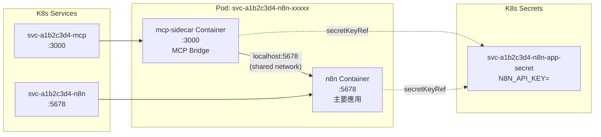

> 同一 Pod 中的 containers 共享 network namespace，因此 MCP sidecar 可以透過 `localhost:5678` 直接存取 n8n API。

---

## 8. Phase 5：n8n 初始化（Post-Deploy Init）

### 8.1 觸發時機

前端定期輪詢服務狀態。當 `_update_service_status()` 偵測到：
- Helm release status = `deployed`
- 所有 Pod 的 `phase` = `Running` 且 `ready` = 全部就緒
- 原始狀態 = `deploying`
- Template 有 `post_deploy_init_type = 'n8n'`

系統將 state 切換為 `initializing` 並呼叫 `_run_post_deploy_init()`。

### 8.2 n8n Init 完整流程

`N8nInitService.initialize()` （`extra/paas-operator/src/services/n8n_init.py:121`）執行以下 6 步驟：

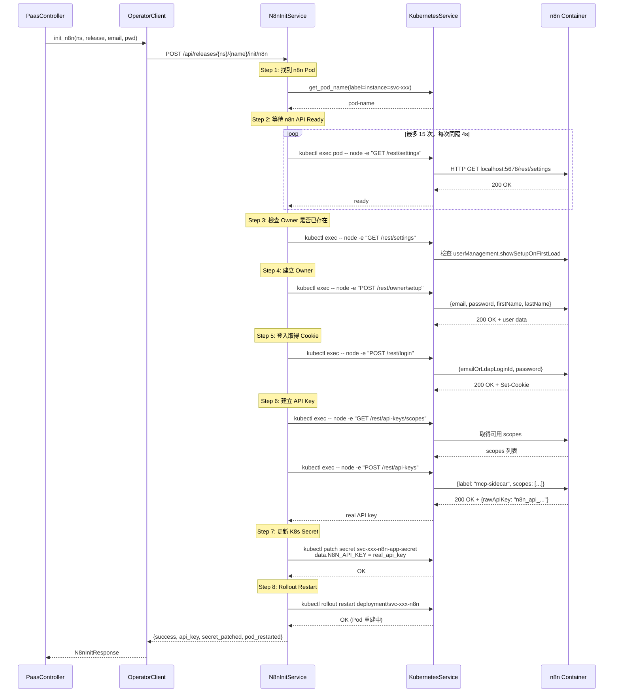

### 8.3 為什麼要用 Node.js 做 HTTP 請求？

n8n container 內建 Node.js runtime 但沒有 `curl`。`wget` 在處理 n8n body parser 的 encoding 時有問題。因此系統使用 `kubectl exec` 在 n8n container 內直接執行 Node.js 一行式腳本來做 HTTP 請求。

### 8.4 失敗重試機制

- 每次輪詢時，若 init 失敗，`init_retries` +1
- 最多重試 5 次
- 超過 5 次後 state 轉為 `error`
- 重試邏輯由前端輪詢 `_update_service_status()` 驅動

---

## 9. Phase 6：MCP Server 自動註冊

### 9.1 自動建立 MCP Server 記錄

當服務成功轉為 `running` 狀態後，`_auto_create_mcp_server()` 方法（`src/controllers/paas.py:2040`）自動建立 `McpServer` 記錄：

```python
McpServer.create({
    'name': f"{service.name} MCP",
    'url': "http://svc-a1b2c3d4-mcp.paas-ws-42.svc.cluster.local:3000/mcp",
    'transport': 'streamable_http',
    'scope': 'user',
    'cloud_service_id': service.id,
    'auto_created': True,
    'api_key': service.mcp_auth_token,  # AUTH_TOKEN for sidecar auth
})
```

### 9.2 MCP Endpoint URL 優先順序

`_build_mcp_endpoint_url()` 方法依以下優先順序建構 URL：

1. **K8s Internal URL**（最可靠）：`http://{release}-mcp.{namespace}.svc.cluster.local:{port}/mcp`
2. **Subdomain URL**（需要 Cloudflare）：`https://{subdomain}.{paas_domain}/mcp`
3. **Localhost fallback**：`http://localhost:{port}/mcp`

### 9.3 Tool 發現與 Cron 重試

- 建立後立即嘗試 `action_sync_tools_safe()` 做 tool 發現
- 若 sidecar 尚未就緒（Pod 重啟中），保持 `state='draft'`
- Cron job（`_cron_retry_mcp_sync`）定期重試 `draft` 狀態的 server
- 最多重試 10 次，超過後標記為 `error`

---

## 10. 狀態機與生命週期

### 10.1 CloudService 狀態轉換

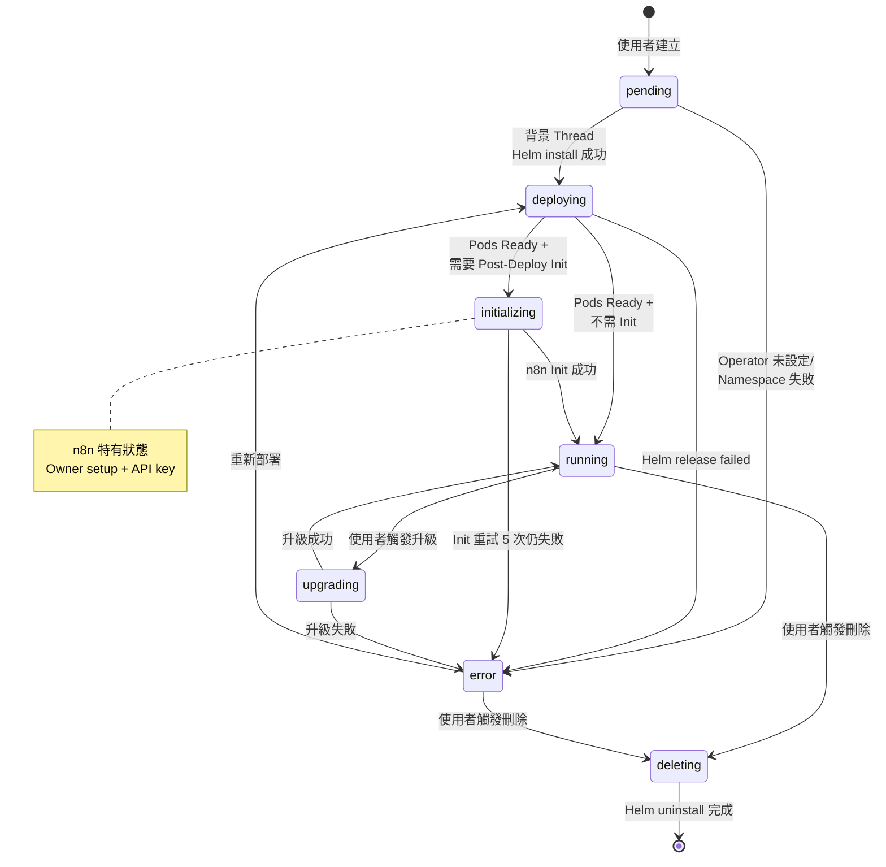

### 10.2 各狀態說明

| 狀態 | 說明 | 持續時間 |
|------|------|---------|
| `pending` | DB 記錄已建，等待部署 | < 1 秒 |
| `deploying` | Helm install 完成，等待 Pods Ready | 30-120 秒 |
| `initializing` | n8n 特有：Owner 設定 + API Key 產生中 | 30-90 秒 |
| `running` | 服務正常運作 | 持續 |
| `upgrading` | Helm upgrade 執行中 | 30-120 秒 |
| `error` | 部署/初始化/升級失敗 | 等待使用者處理 |
| `deleting` | Helm uninstall 執行中 | 10-30 秒 |

---

## 11. 網路拓撲與 FQDN 產生邏輯

### 11.1 完整網路路徑

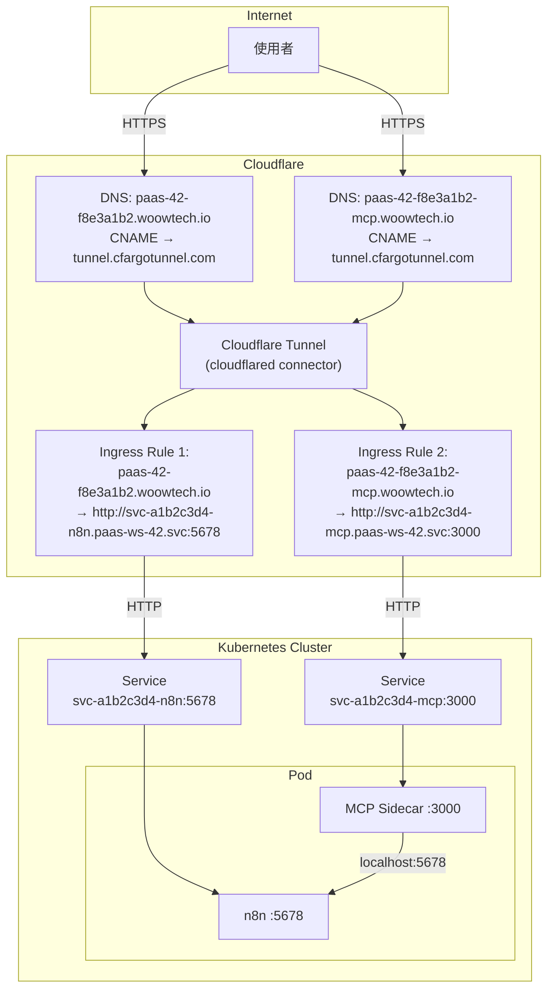

### 11.2 FQDN 產生規則

| 用途 | FQDN 格式 | 範例 |
|------|-----------|------|
| n8n 主應用 | `{subdomain}.{paas_domain}` | `paas-42-f8e3a1b2.woowtech.io` |
| MCP Sidecar | `{subdomain}-mcp.{paas_domain}` | `paas-42-f8e3a1b2-mcp.woowtech.io` |
| MCP Endpoint | `{subdomain}-mcp.{paas_domain}/mcp` | `paas-42-f8e3a1b2-mcp.woowtech.io/mcp` |

### 11.3 Subdomain 產生演算法

```python
salted_input = reference_id + name          # UUID + 服務名稱
name_hash = hashlib.md5(salted_input.encode()).hexdigest()[:8]
subdomain = f"paas-{workspace.id}-{name_hash}"
```

使用 `reference_id`（UUID）作為鹽值，確保相同服務名稱在不同場景下不會產生相同的 subdomain。

---

## 12. API Key 的產生與同步機制

整個 API Key 的生命週期涉及三次變更，這是系統中最精密的同步邏輯之一。

### 12.1 API Key 時間軸

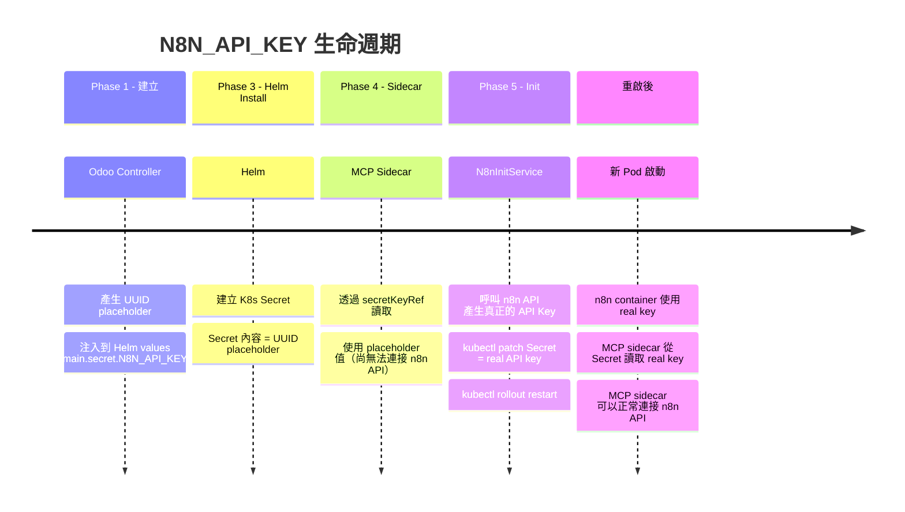

### 12.2 各層的 API Key 狀態

| 階段 | K8s Secret | n8n DB | Sidecar Env | Odoo helm_values |
|------|-----------|--------|-------------|-----------------|
| Helm install 後 | UUID placeholder | N/A | UUID placeholder | UUID placeholder |
| n8n init 後 | real API key | real API key | UUID placeholder (舊 Pod) | real API key |
| rollout restart 後 | real API key | real API key | real API key (新 Pod) | real API key |

### 12.3 為什麼需要 secretKeyRef？

如果 API Key 是直接寫入 sidecar 的 env 中（plain value），則 n8n init 更新 Secret 後，sidecar 仍然使用舊的 placeholder 值。必須整個 Pod 重建才能載入新值。

使用 `secretKeyRef` 的設計確保：
1. Pod 重啟後，container 自動從 K8s Secret 讀取最新值
2. 不需要再次 patch deployment 的 env
3. `rollout restart` 就足以讓新 key 生效

---

## 13. 刪除流程

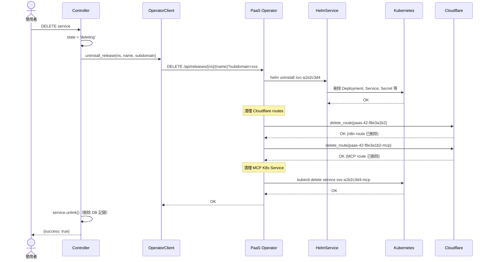

刪除操作清理的資源：

1. **Helm Release**：所有由 Helm 管理的 K8s 資源（Deployment, Service, Secret, PVC 等）
2. **MCP K8s Service**：`{release}-mcp` Service（非 Helm 管理，需額外刪除）
3. **Cloudflare Routes**：主應用 route + MCP sidecar route
4. **Cloudflare DNS**：對應的 CNAME records
5. **Odoo DB 記錄**：CloudService + 關聯的 McpServer（cascade delete）

---

## 14. 關鍵檔案索引

### Odoo 模組

| 檔案 | 說明 |
|------|------|
| `src/controllers/paas.py:1388` | `_create_service()` - 服務建立入口 |
| `src/controllers/paas.py:1520` | `_deploy_service_background()` - 背景部署 |
| `src/controllers/paas.py:1202` | `_build_mcp_sidecar_config()` - Sidecar 配置 |
| `src/controllers/paas.py:1818` | `_update_service_status()` - 狀態輪詢 |
| `src/controllers/paas.py:1934` | `_run_post_deploy_init()` - Post-deploy init |
| `src/controllers/paas.py:2040` | `_auto_create_mcp_server()` - MCP Server 自動建立 |
| `src/controllers/paas.py:2091` | `_build_mcp_endpoint_url()` - MCP URL 建構 |
| `src/models/cloud_service.py` | CloudService 資料模型 |
| `src/models/cloud_app_template.py` | CloudAppTemplate 資料模型 |
| `src/models/mcp_server.py` | McpServer 資料模型 + tool 發現 |
| `src/services/paas_operator.py` | PaaS Operator HTTP Client |
| `src/data/cloud_app_templates.xml` | n8n 模板設定（Helm values, MCP config） |

### PaaS Operator

| 檔案 | 說明 |
|------|------|
| `extra/paas-operator/src/main.py` | FastAPI app 入口 + 認證 middleware |
| `extra/paas-operator/src/api/releases.py` | Helm Release CRUD + Sidecar Patch |
| `extra/paas-operator/src/api/init.py` | n8n Init API endpoint |
| `extra/paas-operator/src/services/helm.py` | HelmService + KubernetesService |
| `extra/paas-operator/src/services/n8n_init.py` | N8nInitService（Owner + API Key） |
| `extra/paas-operator/src/services/cloudflare.py` | Cloudflare Tunnel + DNS 管理 |
| `extra/paas-operator/src/models/schemas.py` | Pydantic request/response schemas |
| `extra/paas-operator/src/config.py` | 環境變數設定 |
